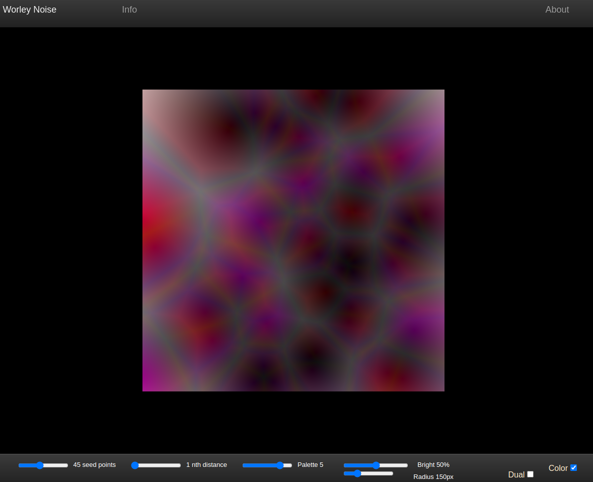

# The Worley Noise

[View Project Running Here](https://mvilarinho.github.io/worleyNoise)

[View Code Here](https://github.com/mvilarinho/worleyNoise/)

This animation is a implementation of the Worley Noise algorithm in 2D.

For each frame, seed points move a random value wich causes the movement.

The Info tab shows what each slide and checkbox do.

This work was developped in with `p5.js` library.

It's inspired these projects:

- The Code Train Challenge [The Code Train](https://thecodingtrain.com/challenges/coding-in-the-cabana/004-worley-noise.html)
- The Book of Shaders [The Book of Shaders](https://thebookofshaders.com/12/)
- Article in Wikipedia [Wikipedia](https://en.wikipedia.org/wiki/Worley_noise)

